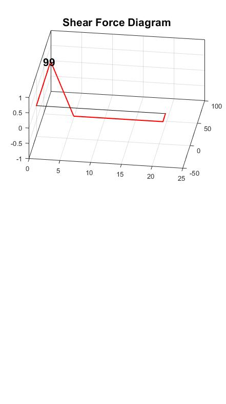

# MEE2002
matlab aNALYSIS &amp; ROUGH ta ON sHEAR, bEND &amp; mOMEMT DEVELOPMENT

## 14BME0133 / MEE2002 / Docs
### To read the manual rant :
Look around this repository for [`fd11.*`](fd11.md).
### To download `.m` files :
Find the `fd11.m` in the `~?subdiroot` of [this](https://github.com/itsN1X/MEE2002) [mirror](https://github.com/14bme0133/MEE2002).

### DDW
`zz##############.###on`
>> `/white`
>> `/14BME0133`
>> `/BACKDOWN$`
>> `/MEE2002`
>> `/latest_by_commits`

### Result-alike :

## Credits
(C) 8045#Q
# *itsN1X*  
[@`14BME0133`](https://14BME0133.GITHUB.IO)    
$[@`NETWORK`](https://ITSN1X.GITHUB.IO)    

### [Click to Contact](mailto:nikhil.pandita2014@vit.ac.in)
